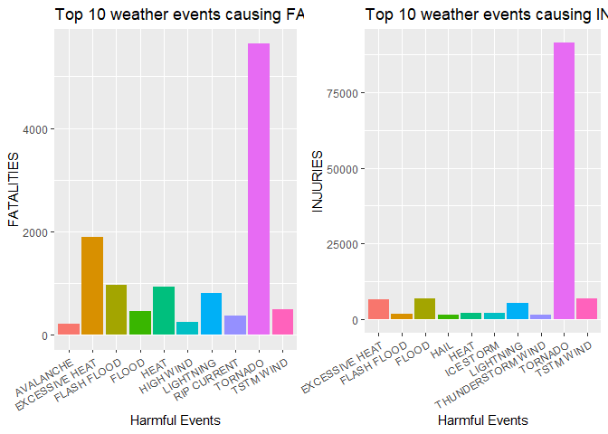
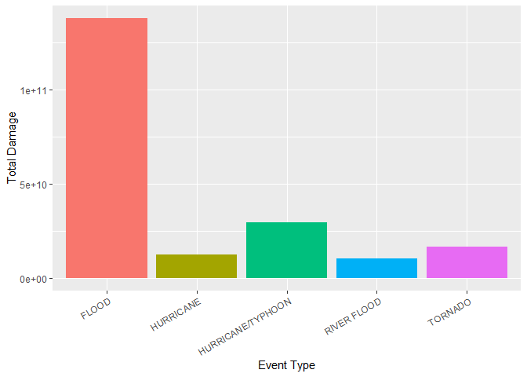

## Introduction

#This project involves exploring the U.S. National Oceanic and Atmospheric Administration's (NOAA) storm database. This database tracks characteristics of major storms and weather events in the United States, including when and where they occur, as well as estimates of any fatalities, injuries, and property damage.

## Synopsis

#In this project we try to explore the NOAA data storm database (1950 - 2011). Our prime objective is to find out what events are most significant in terms of fatalities, injuries and economic damage (property and crop). We'll focus our analysis to answer below two questions:
#Q1. Across the United States, which types of events (as indicated in the EVTYPE variable) are most harmful with respect to population health?
#Q2. Across the United States, which types of events have the greatest economic consequences?


##  Reading Dataset


```r
library(ggplot2)
library(knitr)
library(dplyr)
```

```
## 
## Attaching package: 'dplyr'
```

```
## The following objects are masked from 'package:stats':
## 
##     filter, lag
```

```
## The following objects are masked from 'package:base':
## 
##     intersect, setdiff, setequal, union
```

```r
#getwd()
#dir()


storm<- read.csv2("repdata_data_StormData.csv",  header = TRUE, sep = ",")

#head(storm)
summary(storm)
```

```
##    STATE__            BGN_DATE           BGN_TIME          TIME_ZONE        
##  Length:902297      Length:902297      Length:902297      Length:902297     
##  Class :character   Class :character   Class :character   Class :character  
##  Mode  :character   Mode  :character   Mode  :character   Mode  :character  
##                                                                             
##                                                                             
##                                                                             
##                                                                             
##     COUNTY           COUNTYNAME           STATE              EVTYPE         
##  Length:902297      Length:902297      Length:902297      Length:902297     
##  Class :character   Class :character   Class :character   Class :character  
##  Mode  :character   Mode  :character   Mode  :character   Mode  :character  
##                                                                             
##                                                                             
##                                                                             
##                                                                             
##   BGN_RANGE           BGN_AZI           BGN_LOCATI          END_DATE        
##  Length:902297      Length:902297      Length:902297      Length:902297     
##  Class :character   Class :character   Class :character   Class :character  
##  Mode  :character   Mode  :character   Mode  :character   Mode  :character  
##                                                                             
##                                                                             
##                                                                             
##                                                                             
##    END_TIME          COUNTY_END        COUNTYENDN      END_RANGE        
##  Length:902297      Length:902297      Mode:logical   Length:902297     
##  Class :character   Class :character   NA's:902297    Class :character  
##  Mode  :character   Mode  :character                  Mode  :character  
##                                                                         
##                                                                         
##                                                                         
##                                                                         
##    END_AZI           END_LOCATI           LENGTH             WIDTH          
##  Length:902297      Length:902297      Length:902297      Length:902297     
##  Class :character   Class :character   Class :character   Class :character  
##  Mode  :character   Mode  :character   Mode  :character   Mode  :character  
##                                                                             
##                                                                             
##                                                                             
##                                                                             
##        F              MAG             FATALITIES          INJURIES        
##  Min.   :0.0      Length:902297      Length:902297      Length:902297     
##  1st Qu.:0.0      Class :character   Class :character   Class :character  
##  Median :1.0      Mode  :character   Mode  :character   Mode  :character  
##  Mean   :0.9                                                              
##  3rd Qu.:1.0                                                              
##  Max.   :5.0                                                              
##  NA's   :843563                                                           
##    PROPDMG           PROPDMGEXP          CROPDMG           CROPDMGEXP       
##  Length:902297      Length:902297      Length:902297      Length:902297     
##  Class :character   Class :character   Class :character   Class :character  
##  Mode  :character   Mode  :character   Mode  :character   Mode  :character  
##                                                                             
##                                                                             
##                                                                             
##                                                                             
##      WFO             STATEOFFIC         ZONENAMES           LATITUDE        
##  Length:902297      Length:902297      Length:902297      Length:902297     
##  Class :character   Class :character   Class :character   Class :character  
##  Mode  :character   Mode  :character   Mode  :character   Mode  :character  
##                                                                             
##                                                                             
##                                                                             
##                                                                             
##   LONGITUDE          LATITUDE_E         LONGITUDE_          REMARKS         
##  Length:902297      Length:902297      Length:902297      Length:902297     
##  Class :character   Class :character   Class :character   Class :character  
##  Mode  :character   Mode  :character   Mode  :character   Mode  :character  
##                                                                             
##                                                                             
##                                                                             
##                                                                             
##     REFNUM         
##  Length:902297     
##  Class :character  
##  Mode  :character  
##                    
##                    
##                    
## 
```


##  Data Processing


```r
#Trim the dataset to keep only relevant columns

storm_sub <- storm[, c("BGN_DATE", "EVTYPE", "FATALITIES", "INJURIES", 
    "PROPDMG", "PROPDMGEXP", "CROPDMG", "CROPDMGEXP")]

head(storm_sub)
```

```
##             BGN_DATE  EVTYPE FATALITIES INJURIES PROPDMG PROPDMGEXP CROPDMG
## 1  4/18/1950 0:00:00 TORNADO       0.00    15.00   25.00          K    0.00
## 2  4/18/1950 0:00:00 TORNADO       0.00     0.00    2.50          K    0.00
## 3  2/20/1951 0:00:00 TORNADO       0.00     2.00   25.00          K    0.00
## 4   6/8/1951 0:00:00 TORNADO       0.00     2.00    2.50          K    0.00
## 5 11/15/1951 0:00:00 TORNADO       0.00     2.00    2.50          K    0.00
## 6 11/15/1951 0:00:00 TORNADO       0.00     6.00    2.50          K    0.00
##   CROPDMGEXP
## 1           
## 2           
## 3           
## 4           
## 5           
## 6
```

```r
# Create subset for Question 1 & 2

# Select data for Fatalities and injuries from subset (Q1)

harm <- subset(storm_sub, !storm_sub$FATALITIES == 0 & !storm_sub$INJURIES == 
    0, select = c(EVTYPE, FATALITIES, INJURIES))

harm$FATALITIES <- as.numeric(as.character(harm$FATALITIES))
harm$INJURIES <- as.numeric(as.character(harm$INJURIES))

head(harm)
```

```
##    EVTYPE FATALITIES INJURIES
## 1 TORNADO          0       15
## 2 TORNADO          0        0
## 3 TORNADO          0        2
## 4 TORNADO          0        2
## 5 TORNADO          0        2
## 6 TORNADO          0        6
```

```r
# Select data for various damages from subset (Q2)

Dam <- subset(storm_sub, !storm_sub$PROPDMG == 0 & !storm_sub$CROPDMG == 
    0, select = c(EVTYPE, PROPDMG, PROPDMGEXP, CROPDMG, CROPDMGEXP))

head(Dam)
```

```
##    EVTYPE PROPDMG PROPDMGEXP CROPDMG CROPDMGEXP
## 1 TORNADO   25.00          K    0.00           
## 2 TORNADO    2.50          K    0.00           
## 3 TORNADO   25.00          K    0.00           
## 4 TORNADO    2.50          K    0.00           
## 5 TORNADO    2.50          K    0.00           
## 6 TORNADO    2.50          K    0.00
```

## Q1 - Across the United States, which types of events (as indicated in the EVTYPE variable) are most harmful with respect to population health?


```r
# Create separate data set for Fatalities

fatal <- harm %>%
          group_by(EVTYPE) %>%
          summarise_each(funs(sum))%>% 
          arrange(desc(FATALITIES))
```

```
## Warning: `summarise_each_()` is deprecated as of dplyr 0.7.0.
## Please use `across()` instead.
## This warning is displayed once every 8 hours.
## Call `lifecycle::last_warnings()` to see where this warning was generated.
```

```
## Warning: `funs()` is deprecated as of dplyr 0.8.0.
## Please use a list of either functions or lambdas: 
## 
##   # Simple named list: 
##   list(mean = mean, median = median)
## 
##   # Auto named with `tibble::lst()`: 
##   tibble::lst(mean, median)
## 
##   # Using lambdas
##   list(~ mean(., trim = .2), ~ median(., na.rm = TRUE))
## This warning is displayed once every 8 hours.
## Call `lifecycle::last_warnings()` to see where this warning was generated.
```

```r
#head(fatal)

# Take top 10 events for Fatalities and corresponding Injuries

fatal <- fatal[1:10,]

# Create separate data set for Injury

Inj <- harm %>%
          group_by(EVTYPE) %>%
          summarise_each(funs(sum))%>% 
          arrange(desc(INJURIES))
         
#head(Inj)

# Take top 10 events for Injuries

Inj <- Inj[1:10,]
#head(Inj)

# Plot Fatalities and store at fatal_plot
library(ggplot2)

fatal_plot <- ggplot() + geom_bar(data = fatal, aes(x = EVTYPE, 
    y =FATALITIES, fill = interaction(FATALITIES, EVTYPE)), stat = "identity", 
    show.legend = F) + theme(axis.text.x = element_text(angle = 30, hjust = 1)) + 
    xlab("Harmful Events") + ylab("FATALITIES") + ggtitle("Top 10 weather events causing FATALITIES") + 
    theme(axis.text.x = element_text(angle = 30, hjust = 1))

# Plot Fatalities and store at Inj_plot
Inj_plot <- ggplot() + geom_bar(data = Inj, aes(x = EVTYPE, 
    y =INJURIES, fill = interaction(INJURIES, EVTYPE)), stat = "identity", 
    show.legend = F) + theme(axis.text.x = element_text(angle = 30, hjust = 1)) + 
    xlab("Harmful Events") + ylab("INJURIES") + ggtitle("Top 10 weather events causing INJURIES") + 
    theme(axis.text.x = element_text(angle = 30, hjust = 1))

#Show both plots for Fatalities and Injuries

require("gridExtra")
```

```
## Loading required package: gridExtra
```

```
## 
## Attaching package: 'gridExtra'
```

```
## The following object is masked from 'package:dplyr':
## 
##     combine
```

```r
grid.arrange(fatal_plot, Inj_plot, ncol = 2)
```

<!-- -->
## Assessment for Q1: Tornados are the most harmful in terms of Fatality and Injury based on given data

## Q2 - Across the United States, which types of events have the greatest economic consequences?


```r
# select required entries for economy damage
Dam <- subset(Dam, Dam$PROPDMGEXP == "K" | Dam$PROPDMGEXP == 
    "k" | Dam$PROPDMGEXP == "M" | Dam$PROPDMGEXP == "m" | 
    Dam$PROPDMGEXP == "B" | Dam$PROPDMGEXP == "b")

Dam <- subset(Dam, Dam$CROPDMGEXP == "K" | Dam$CROPDMGEXP == 
    "k" | Dam$CROPDMGEXP == "M" | Dam$CROPDMGEXP == "m" | 
    Dam$CROPDMGEXP == "B" | Dam$CROPDMGEXP == "b")

# Convert economic values to number
Dam$PROPDMGEXP <- gsub("m", 1e+06, Dam$PROPDMGEXP, ignore.case = TRUE)
Dam$PROPDMGEXP <- gsub("k", 1000, Dam$PROPDMGEXP, ignore.case = TRUE)
Dam$PROPDMGEXP <- gsub("b", 1e+09, Dam$PROPDMGEXP, ignore.case = TRUE)
Dam$PROPDMGEXP <- as.numeric(Dam$PROPDMGEXP)
Dam$CROPDMGEXP <- gsub("m", 1e+06, Dam$CROPDMGEXP, ignore.case = TRUE)
Dam$CROPDMGEXP <- gsub("k", 1000, Dam$CROPDMGEXP, ignore.case = TRUE)
Dam$CROPDMGEXP <- gsub("b", 1e+09, Dam$CROPDMGEXP, ignore.case = TRUE)
Dam$CROPDMGEXP <- as.numeric(Dam$CROPDMGEXP)
Dam$PROPDMGEXP <- as.numeric(Dam$PROPDMGEXP)
Dam$CROPDMG <- as.numeric(Dam$CROPDMG)
Dam$PROPDMG <- as.numeric(Dam$PROPDMG)

# then sum the damages by each event type
Dam$TOTALDMG <- (Dam$CROPDMG * Dam$CROPDMGEXP) + 
    (Dam$PROPDMG * Dam$PROPDMGEXP)

Dam <- aggregate(Dam$TOTALDMG, by = list(Dam$EVTYPE), 
    FUN = sum)

colnames(Dam) <- c("EVTYPE", "TOTALDMG")

# Rank the event type by highest damage cost and take top 5 columns
Dam <- Dam[order(Dam$TOTALDMG, decreasing = TRUE), 
    ]
Dam <- Dam[1:5, ]

# Now plot the graph
ggplot() + geom_bar(data = Dam, aes(x = EVTYPE, y = TOTALDMG, fill = interaction(TOTALDMG, 
    EVTYPE)), stat = "identity", show.legend = F) + theme(axis.text.x = element_text(angle = 30, 
    hjust = 1)) + xlab("Event Type") + ylab("Total Damage")
```

<!-- -->
## Q2 Assessment: Flood brings most economic damage as per given data.

## Result


```r
# As per the analysis of given data, we can infer that:

#1. Tornados are most harmful event in terms of fatality and Injuries.
#2. Flood is most harmful even in terms of economic damage.
```
